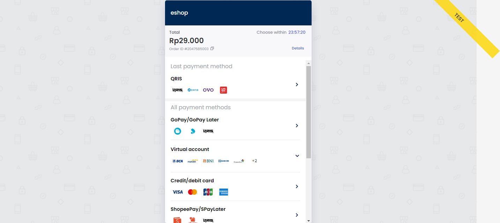
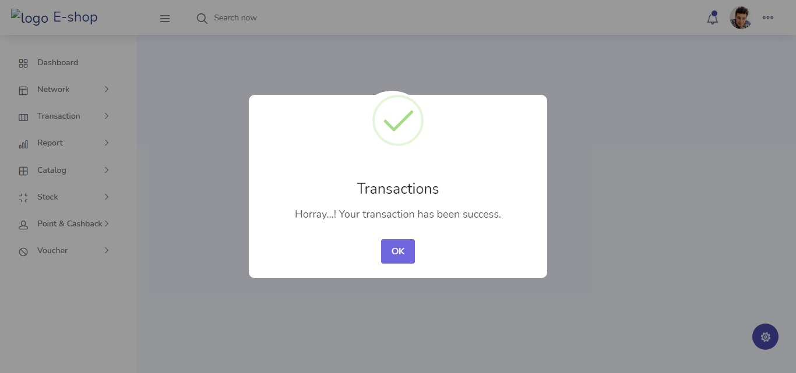
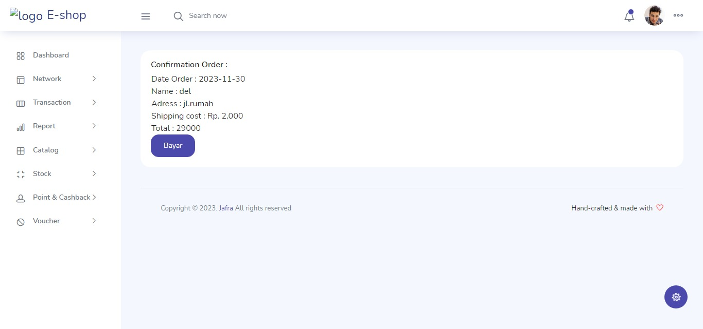
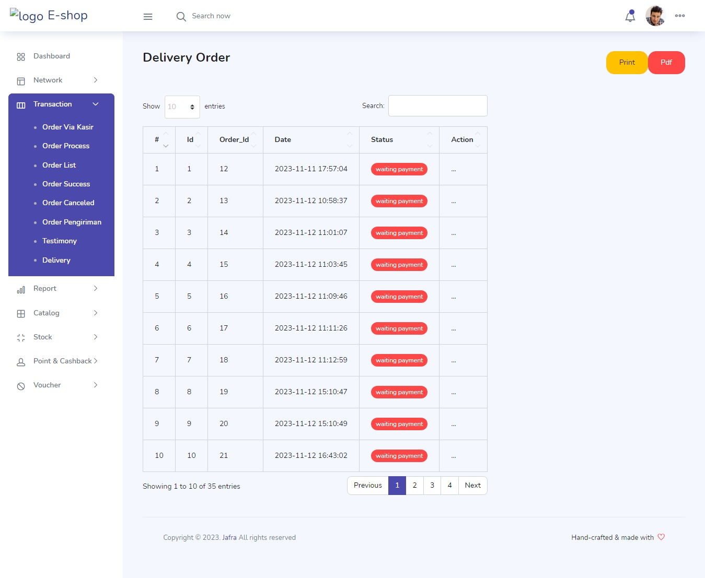
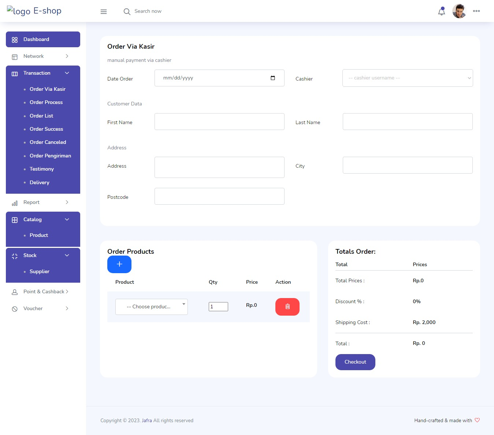

###################
Simple integrating Payment gateway using MIDTRANS
###################

Download or clone this repo git clone https://github.com/whiskey34/learning-payment-gateway.git

and then run composer via terminal to install midtrans library at your root,
to get vendor/ folder at your root.

use this command : 

.. literal-block::

   composer require midtrans/midtrans-php

After running the command, make sure to include the Composer autoloader in your project:

.. literal-block::

   require 'vendor/autoload.php';

Don't forget to changes config with your Midtrans access key at controller/Kasir.php

and Done... you can try it by yourself!.. :D

For any further info about midtras see the Documentation at `Midtrans Documentation <https://docs.midtrans.com>`_ .

Some Screenshot :

To login for admin : 

username = admindev,

password = 123

for Kasir :

username = Kasir,

password = kasir

###################
What is CodeIgniter
###################

CodeIgniter is an Application Development Framework - a toolkit - for people
who build web sites using PHP. Its goal is to enable you to develop projects
much faster than you could if you were writing code from scratch, by providing
a rich set of libraries for commonly needed tasks, as well as a simple
interface and logical structure to access these libraries. CodeIgniter lets
you creatively focus on your project by minimizing the amount of code needed
for a given task.

*******************
Release Information
*******************

This repo contains in-development code for future releases. To download the
latest stable release please visit the `CodeIgniter Downloads
<https://codeigniter.com/download>`_ page.

*******************
Server Requirements
*******************

PHP version 5.6 or newer is recommended.

It should work on 5.3.7 as well, but we strongly advise you NOT to run
such old versions of PHP, because of potential security and performance
issues, as well as missing features.

************
Installation
************

Please see the `installation section <https://codeigniter.com/userguide3/installation/index.html>`_
of the CodeIgniter User Guide.

***************
Acknowledgement
***************

The CodeIgniter team would like to thank EllisLab, all the
contributors to the CodeIgniter project and you, the CodeIgniter user.
